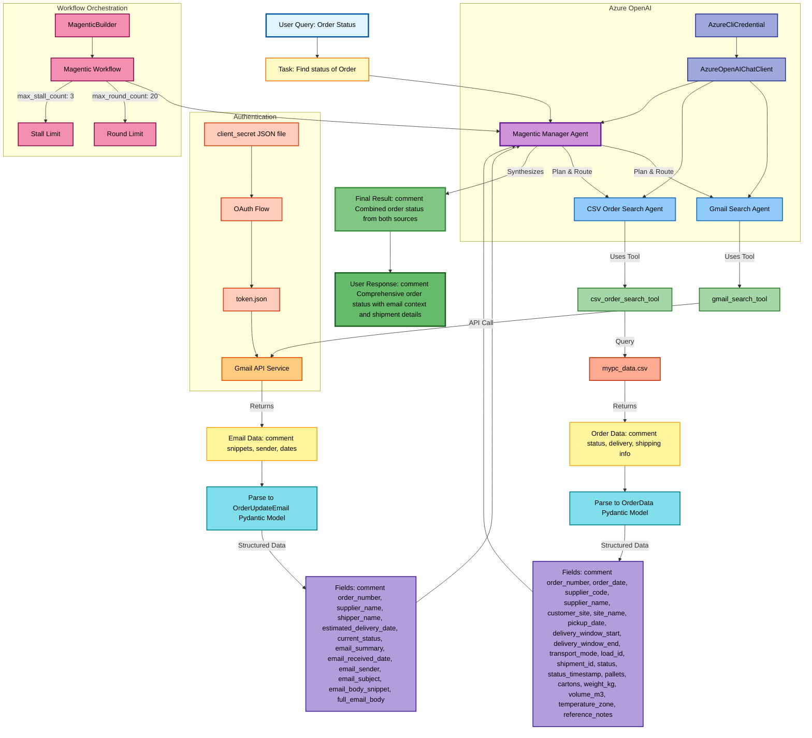

# Primary Connect Order Tracking Workflow



## Workflow Description

This diagram illustrates the Primary Connect order tracking system that:

1. **Receives User Query**: User asks about order status by order number
2. **Manager Orchestration**: Magentic Manager coordinates between specialized agents
3. **Parallel Data Sources**:
   - Gmail Agent searches email for order updates and communications
   - CSV Agent queries local order database for shipment details
4. **Data Retrieval**:
   - Gmail API fetches relevant emails with order updates
   - CSV file provides structured order and shipment data
5. **Structured Parsing**: Results are parsed into Pydantic models for validation
6. **Synthesis**: Manager combines both data sources into a comprehensive response
7. **Authentication**: Gmail uses OAuth 2.0 flow with stored credentials
8. **AI Integration**: Azure OpenAI powers all agents using AzureCliCredential
9. **Workflow Management**: MagenticBuilder orchestrates multi-agent collaboration

## Key Components

- **Gmail Search Tool**: Searches emails for order communications
- **CSV Order Search Tool**: Queries mypc_data.csv for shipment data
- **OrderUpdateEmail Model**: Structures email-based order information
- **OrderData Model**: Structures CSV-based shipment information
- **Magentic Workflow**: Coordinates agent collaboration with round and stall limits
```
